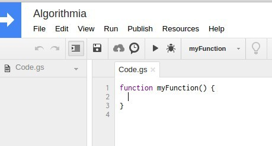
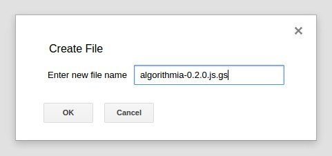
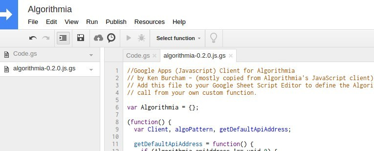
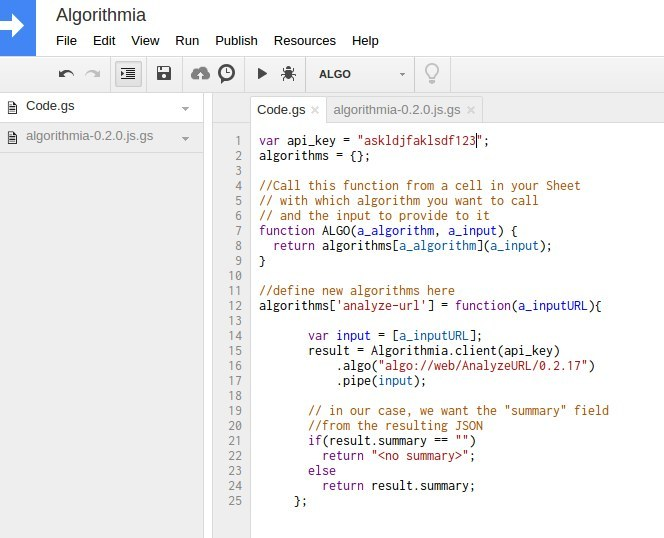
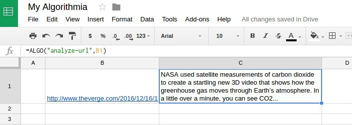

# algorithmia-google

Algorithmia.com calls itself a "marketplace for algorithms", but I rather see it as a "rocket engine powered, scalable, artificial intelligence algorithm cloud hosting platform!"

There are thousands of algorithms currently hosted on Algorithmia. As a developer, you can think of these as a library of API endpoints that take some input and return some output, doing some magic in between. The magic is optimized for performance using a cloud of GPUs and as they say, it is a "deep learning architecture built for scale."

Currently, I'm working at an international school in Cambodia and we use Google Apps for everything. I've enjoyed writing custom functions in Google App Scripting to solve certain problems. When I learned that with Algorithmia I can add artificial intelligence functions via an API, I was excited to see if I could add some zippy artificial intelligence to my Google Sheets!

However, I quickly discovered that the basic JavaScript client for Algorithmia won't work inside of Google Apps. Google Apps is a sandbox that requires you to call to the outside using only their request object. After a few modifications, I was able to get it to work and the full tutorial is below. Enjoy!

# How to create a Google Apps custom function for Algorithmia

## Step 0 - Get your Algorithmia API key
Head on over to http://algorithmia.com and sign up for a new account (or sign in to your old one). Once you're in, go to "My Profile" and choose "Credentials" and copy your API key. You'll need it for a later step.

## Step 1 - Create a new Google Sheet document
You can do this by going to
https://docs.google.com/spreadsheets and clicking the big plus icon.

## Step 2 - Name your sheet "My Algorithmia" or whatever you like
Always good to choose a name.

## Step 3 - Open the "Script editor"
Choose "Tools-->Script editor" from the menu. This will open a new tab with the script editor open for your sheet.

On the script editor tab, you'll also want to name your script file. I suggest "Algorithmia".



## Step 4 - Add my basic Google App client
*Remember that this code is my own simple, basic but working version that will most likely need tweaked for your particular application.*

Choose "File-->New-->Script file" from the menu. This will open a dialog for you to name your file. I suggest using the name "algorithmia-0.2.0.js.gs".



Now copy and paste the below code into the script editor code window. Just delete the default function that Google adds for you.

(You can find the most updated code on github here: https://github.com/kenburcham/algorithmia-google/blob/master/algorithmia-0.2.0.js.gs)

```javascript
//Google Apps (Javascript) Client for Algorithmia
// by Ken Burcham - (mostly copied from Algorithmia's JavaScript client)
// Add this file to your Google Sheet Script Editor to define the Algorithmia client you can
// call from your own custom function.

var Algorithmia = {};

(function() {
  var Client, algoPattern, getDefaultApiAddress;

  getDefaultApiAddress = function() {
    if (Algorithmia.apiAddress !== void 0) {
      return Algorithmia.apiAddress;
    } else {
      return "https://api.algorithmia.com/v1/web/algo";
    }
  };

  algoPattern = /^(?:algo:\/\/|\/|)(\w+\/.+)$/;

  Algorithmia.query = function(algo_uri, api_key, input, cb) {
    return Algorithmia.client(api_key).algo(algo_uri).pipe(input, function(result) {
      if (result.error) {
        return cb(result.error.message || result.error);
      } else {
        return cb(void 0, result.result);
      }
    });
  };

  Algorithmia.client = function(api_key, api_address) {
    //Logger.log("Client loading...");
    api_key = api_key || Algorithmia.apiKey;
    api_address = api_address || getDefaultApiAddress();
    return new Client(api_key, api_address);
  };

  Client = function(api_key, api_address) {
    this.api_key = api_key;
    this.api_address = api_address;
    this.algo = function(algo_uri) {
      if (algo_uri && typeof algo_uri === "string") {
        return new Algorithm(this, algo_uri);
      } else {
        console.error("Invalid algorithm url: " + algo_uri);
        return null;
      }
    };
  };

  Algorithmia.algo = function(algo_uri) {
    return Algorithmia.client().algo(algo_uri);
  };

  Algorithm = function(client, algo_uri) {
    if (!(typeof algo_uri === "string" && algo_uri.match(algoPattern))) {
      throw "Invalid Algorithm URI (expected /owner/algo)";
    }
    this.client = client;
    this.algo_uri = algo_uri.match(algoPattern)[1];
    this.pipe = function(input, cb) {
          endpoint_url = client.api_address + "/" + this.algo_uri;
          payload = JSON.stringify(input);
          //Logger.log(payload);
          var options = {
            'muteHttpExceptions':false,
            'method': 'post',
            'headers': {"Content-Type":"application/json",
                        "Accept":"application/json, text/javascript",
                        "Authorization":"Simple " + client.api_key
                       },
            'payload':payload
          };

          var response = UrlFetchApp.fetch(endpoint_url, options);

          var json = response.getContentText();
          var data = JSON.parse(json);

          return data.result;
        };

  };

}).call(this);
```

*Make sure to type CTRL-S and save your work!*

When you're done your script editor will look something like this:



## Step 5 - Create your custom function
Now that you have a client you can use to call algorithms on Algorithmia, let's setup the function you can use in your Google Sheet to do magic.

Click back onto the "Code.gs" tab and delete the example function that Google gives you and create your own basic function called ALGO:

(my most up to date version is here: https://github.com/kenburcham/algorithmia-google/blob/master/code.js.gs)

```javascript
var api_key = "API_KEY"; //replace this with YOUR api key!
algorithms = {};

//Call this function from a cell in your Sheet
// with which algorithm you want to call
// and the input to provide to it
function ALGO(a_algorithm, a_input) {
  return algorithms[a_algorithm](a_input);
}

//define new algorithms here
algorithms['analyze-url'] = function(a_inputURL){

       var input = [a_inputURL];
       result = Algorithmia.client(api_key)
           .algo("algo://web/AnalyzeURL/0.2.17")
           .pipe(input);

       // in our case, we want the "summary" field
       //from the resulting JSON
       if(result.summary == "")
         return "<no summary>";
       else
         return result.summary;
     };

```

*Make sure to save your work.*

Now your Script editor should look something like this:



The back-end of your custom function is ready to go. Let's switch over to the Google Sheet and see some magic!

## Step 6 - Use your shiny new custom function
The moment you've been waiting for is to see some artificial intelligence happen inside your own Google Sheet courtesy of Algorithmia.

The "AnalyzeURL" function that we'll be calling will read in the content of a given web page and summarize it for you using an AI natural language processing algorithm.

In your Google Sheet, paste the following URL (or choose your own) into cell B1 (or whatever you like)

http://www.theverge.com/2016/12/16/13989590/nasa-3d-video-carbon-dioxide-co2-earth-atmosphere

In cell B2, you want to call your custom function, passing in the name of the algorithm we defined ("analyze-url") and give it the cell of your URL as input to the function (B1). So add the following function to cell B2:

    =ALGO("analyze-url",B1)

When you move off of the cell, it will calculate the value causing it to fire your function which will make a call out to Algorithmia, hit the REST microservice that wraps the AnalyzeURL algorithm, process your URL and return back the result. Take a look at the [definition of the AnalyzeURL algorithm](https://algorithmia.com/algorithms/web/AnalyzeURL) if you are curious!

If everything works properly, your sheet will magically have a summary produced by Algorithmia's AI.


## Conclusion
I'm excited to add Algorithmia capability to my Google Sheets. I also want to create my own algorithm as well. The way Algorithmia works is that each API call costs a certain number of credits. So if you create an algorithm that is popular, you can actually make a royalty off of every call! Of course, this also means that if you make more calls than your free credit limit, you'll have to pay some real money to keep using it. But if it is adding real value then I won't mind paying. I'm glad they give you some free credits to try it all out.

Please let me know if I've made any mistakes and I'll be happy to correct them. Enjoy!
